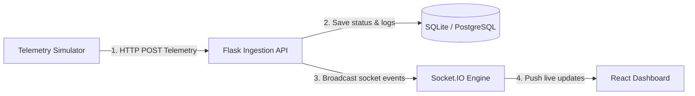

# 🎥 CamGuard — Multi-Camera Enterprise Health Monitoring Platform

[](https://github.com/chudasamapujan/CamGuard/actions/workflows/ci.yml)
[](https://opensource.org/licenses/MIT)
[](TEST_REPORT.md)
[](TEST_REPORT.md)

CamGuard is an enterprise-grade, production-ready real-time health monitoring and anomaly detection platform for distributed security camera networks. It is designed to handle silent device failures (e.g., latency spikes, high CPU load, storage depletion, and unexpected offline states) across large-scale physical security deployments. The system uses a containerized, event-driven architecture featuring a React SPA, a WSGI Flask backend optimized with an asynchronous `Eventlet` event loop, a multi-threaded telemetry simulator, and an SSL-secured Nginx reverse proxy.

---

## 🚀 Project Highlights

*   **Enterprise-Style Architecture:** A multi-container, orchestrated system separating ingestion services, UI presentation layers, and database resources into modular, isolated networks.
*   **Real-Time Monitoring:** Event-driven, low-latency client updates using persistent `Socket.IO` WebSockets powered by an asynchronous `Eventlet` worker loop.
*   **Docker & Orchestration:** Uniform containerization of all tiers (frontend, backend, simulator) orchestrated via Docker Compose for consistent development and production parity.
*   **GitHub Actions CI/CD:** Continuous Integration pipelines verifying Python compilation, running backend unit tests with coverage, executing frontend vitest suites, and building production images.
*   **Automated Testing:** 21 Pytest integration and unit tests (~87% backend statement coverage) and 25 Vitest React Testing Library tests verifying state changes, routing, and WebSockets.
*   **Production Deployment Suite:** Automated bash scripts managing host configuration, zero-downtime rolling container updates, data archiving, and live verification.
*   **Security Built-In:** High-frequency rate limiting (`Flask-Limiter`), secure session headers, API-key authentication enforcement for administration, and SSL/TLS termination via Nginx.
*   **AWS Ready:** Optimized configuration files specifically designed for deployment on AWS EC2 (Ubuntu 22.04 LTS) instances.

---

## 🏗️ Why CamGuard?

Enterprise IP-camera networks are vulnerable to silent infrastructure failures. A camera may continue to power on and present a link signal while failing to record or stream due to file system corruption, memory leaks, high processor load, or network routing degradations. Manually inspecting hundreds of remote endpoints is resource-intensive and prone to delay.

CamGuard addresses these issues by decoupling metrics collection, real-time alert evaluation, and operator interfaces:
1.  **Decoupled Metric Ingestion:** A high-throughput, rate-limited ingestion endpoint processes telemetry signals concurrently from edge devices or virtual simulation nodes.
2.  **Stateful Evaluation Service:** Rules verify CPU, memory, storage usage, and connection latency limits against central settings. Heartbeat tracking auto-detects offline devices within 90 seconds.
3.  **Instant Operator Notifications:** State mutations trigger immediate database records and WebSocket broadcasts, bypassing polling to update operations dashboards in sub-second intervals.
4.  **Production-First Engineering:** Rather than a simple prototype, the project contains structural rate-limiting, custom database index strategies, structured rotating logger handlers, and transaction-safe anomaly resolution.

---

## 📊 Repository Overview

| Dimension | Description |
| :--- | :--- |
| **Architecture** | Event-driven microservices architecture separating Ingestion, UI Dashboards, and Simulation. |
| **Frontend** | React (Vite-based SPA) built with Vanilla CSS for style isolation and high-performance rendering. |
| **Backend** | Flask 3.x backend wrapped in Gunicorn using the Eventlet asynchronous worker pool. |
| **Database** | SQLAlchemy ORM supporting SQLite (default local development) and PostgreSQL (production). |
| **Communication** | WebSocket upgrades (`socket.io-client`), HTTP JSON telemetry POST streams. |
| **Deployment** | Multi-container Docker Compose with isolated networks, static asset hosting, and host mount persistence. |
| **Testing** | Unified Pytest (backend services/endpoints) & Vitest with Happy-DOM (frontend interfaces/socket state). |
| **CI/CD** | GitHub Actions validating code formatting, execution tests, production bundle compilation, and image builds. |
| **Cloud** | Custom deployment target script suite for Ubuntu 22.04 LTS EC2 instances. |
| **Security** | Flask-Limiter controls, API-key route guards, TLS-encrypted Nginx server proxies, CORS configurations. |

---

## 🏗️ System & AWS EC2 Deployment Architecture

Traffic enters securely from the internet through a production-hardened `Nginx` reverse proxy. Nginx handles TLS termination, serves compiled static React assets directly from disk, and routes API endpoints and WebSocket connection upgrades to the WSGI backend.

```
+-----------------------------------------------------------------------------------------------+
|                                        INTERNET / CLIENTS                                     |
+-----------------------------------------------------------------------------------------------+
                                             ↓ HTTPS (Port 443) / HTTP (Port 80 Redirects)
+===============================================================================================+
| AWS EC2 Instance (Ubuntu 22.04 LTS)                                                           |
|                                                                                               |
|   +---------------------------------------------------------------------------------------+   |
|   | Docker Compose Bridge Network (camguard-net)                                          |   |
|   |                                                                                       |   |
|   |   +-------------------------------------------------------------------------------+   |   |
|   |   | Nginx Reverse Proxy (camguard-frontend:80/443)                                |   |   |
|   |   |  • Serves React SPA Static Files (/usr/share/nginx/html)                      |   |   |
|   |   |  • Handles SSL/TLS Encryption & Strict Security Headers                       |   |   |
|   |   |  • Upgrades and Proxies WebSockets to Backend                                 |   |   |
|   |   +-------------------------------------------------------------------------------+   |   |
|   |                  ↓ Upgraded WebSockets & API Requests                                 |   |
|   |   +-------------------------------------------------------------------------------+   |   |
|   |   | Gunicorn + Eventlet WSGI Application Server (camguard-backend:5000)            |   |   |
|   |   |  • Flask Blueprints (Routes & Controller Handlers)                            |   |   |
|   |   |  • Socket.IO Asynchronous Event Server                                        |   |   |
|   |   |  • Services Layer (Health Evaluation, Alert Service, History)                 |   |   |
|   |   +-------------------------------------------------------------------------------+   |   |
|   |               ↓ Read/Write                                 ↑ HTTP POST Telemetry      |   |
|   |   +----------------------------------+         +----------------------------------+   |   |
|   |   | Persistent Volume Mounts         |         | Autonomous Simulator Container   |   |   |
|   |   |  • SQLite DB (health.db)         |         | (camguard-simulator)             |   |   |
|   |   |  • Rotating Application Logs     |         |  • Dynamic, multi-threaded pool  |   |   |
|   |   +----------------------------------+         +----------------------------------+   |   |
|   +---------------------------------------------------------------------------------------+   |
+===============================================================================================+
```

---

## 🔄 Real-Time Data Flow

The platform updates operator interfaces in sub-second intervals without page reloads using a one-way reactive data loop:



1. **Telemetry Transmission:** Camera simulator threads send health metrics (CPU, Memory, Storage, Latency, status) to the backend `/health` endpoint at configured intervals.
2. **Evaluation & Ingestion:** The backend checks the metrics against threshold rules to determine the camera status (`online`, `warning`, `critical`, or `offline`).
3. **Database Persistence:** The health details and active/resolved alert incidents are saved to the relational database.
4. **WebSocket Broadcast:** Upon successful database commits, the backend triggers events (`camera_update`, `alert_created`, `dashboard_summary`) through Socket.IO, pushing instant updates to all active web clients.

---

## 📂 Folder Structure

```
camera-health-monitor/
├── .github/
│   └── workflows/
│       └── ci.yml               # GitHub Actions CI workflow config
├── backend/                     # Python Flask API & WebSocket Server
│   ├── routes/                  # Controller blueprints routing requests
│   │   ├── alerts.py            # Event log management & resolution endpoints
│   │   ├── auth.py              # API key verification endpoint
│   │   ├── cameras.py           # Camera fleet aggregation routes
│   │   ├── docs.py              # Swagger UI host router
│   │   ├── health.py            # Telemetry ingestion endpoint
│   │   └── settings.py          # Configuration threshold controls
│   ├── services/                # Business logic services
│   │   ├── alert_service.py     # Evaluation Engine and Deduplication Logic
│   │   ├── configuration_service.py # System setting migrations & defaults
│   │   ├── health_evaluation_service.py # Status checks & heartbeat timeout logic
│   │   └── history_service.py   # Timeseries window consolidation
│   ├── tests/                   # Python Pytest suite
│   │   ├── conftest.py          # Database & client test fixtures
│   │   ├── test_routes.py       # Controller integration tests
│   │   └── test_services.py     # Business logic unit tests
│   ├── app.py                   # Application factory, CORS, and handlers
│   ├── config.py                # Environment configuration wrapper
│   ├── database.py              # SQLAlchemy initialization interface
│   ├── models.py                # Database schemas (Camera, HealthRecord, Alert, Setting)
│   ├── openapi.yaml             # OpenAPI 3.0 API spec definition
│   ├── socket_manager.py        # Socket.IO Eventlet broker setup
│   └── wsgi.py                  # Production Gunicorn class interface
├── dashboard/                   # React SPA Frontend (Vite)
│   ├── src/
│   │   ├── __tests__/           # Frontend Vitest test files
│   │   ├── components/          # Reusable view components (StatusBadge, Cards, Charts)
│   │   ├── contexts/            # React Theme & WebSocket Providers
│   │   ├── hooks/               # Custom lifecycle helper hooks
│   │   ├── pages/               # Primary Dashboard & Settings layout pages
│   │   ├── services/            # Axios API client & Socket.IO connect wrappers
│   │   ├── utils/               # Format helpers
│   │   ├── App.css              # Main style implementation
│   │   ├── index.css            # Root design configuration tokens
│   │   └── main.jsx             # React DOM entry point
│   ├── vite.config.js           # Vite server & Vitest configuration
│   └── package.json             # NPM package manifest
├── deployment/                  # Production Deployment scripts
│   ├── setup.sh                 # VM provisioning (Docker engine, UFW rules, logs dir)
│   ├── deploy.sh                # Automated build and health validation runner
│   ├── backup.sh                # SQLite & rotating log archiver script
│   └── update.sh                # Git synchronization & rolling update script
├── simulator/                   # Autonomous Multi-Threaded Simulator
│   ├── camera.py                # Simulated camera metrics generator
│   ├── config.py                # Simulator environment options
│   └── run_simulator.py         # Multi-threaded camera orchestrator
├── Dockerfile.backend           # Multi-stage Backend image config
├── Dockerfile.frontend          # Multi-stage Node-compile / Nginx server image config
├── Dockerfile.simulator         # Simulator application image config
├── docker-compose.yml           # Production multi-service manifest
├── nginx.conf                   # Reverse proxy routing, Gzip, and SSL configs
├── requirements.txt             # Primary production dependencies
├── requirements-dev.txt         # Testing dependencies
└── TEST_REPORT.md               # Backend/Frontend Test Coverage Details
```

---

## 🛠️ Technology Stack

### Frontend
*   **React 19.x & Vite:** Fast single-page application framework using ESM compilation.
*   **React Router DOM v7:** Modular client-side URL routing.
*   **Chart.js & React-Chartjs-2:** Interactive HTML5 canvas rendering for telemetry history.
*   **Lucide React:** Clean, lightweight SVG vector symbols.
*   **Vanilla CSS:** Fine-grained, modular application-specific styling without framework overhead.

### Backend
*   **Flask 3.x:** Lightweight Python WSGI web framework.
*   **Flask-SQLAlchemy:** SQLAlchemy ORM bindings managing object models.
*   **Flask-CORS:** Controls Cross-Origin Resource Sharing.
*   **Flask-Limiter:** Enforces route-level rate controls.
*   **Flask-Migrate:** Database migrations using Alembic.
*   **Gunicorn:** High-performance production WSGI application server.

### Database
*   **SQLite:** Serverless relational store used for zero-configuration deployments.
*   **PostgreSQL Support:** Codebase structures allow swapping stores via the environment variables.

### Real-Time Communication
*   **Flask-SocketIO / python-socketio:** Integrates Socket.IO event servers inside Flask.
*   **Socket.IO Client:** Handles reconnection loops and state synchronization in React.
*   **Eventlet:** Concurrency library patching socket behaviors for asynchronous WebSocket flows.

### DevOps & Cloud
*   **Docker & Docker Compose:** Containerization, network isolation, and shared storage layers.
*   **Nginx:** Proxy server, SSL/TLS, Gzip compression, and caching header configuration.
*   **AWS EC2:** Deployment target running Linux (Ubuntu 22.04 LTS).

### Testing
*   **pytest & pytest-cov:** Python test runner with structural coverage reporters.
*   **vitest & Happy-DOM:** ESM-native test runner simulating browser interfaces.
*   **React Testing Library:** Renders components to execute assertion statements.

### Security
*   **SSL/TLS (HTTPS):** Encryption configured on port 443 with self-signed certificate generation fallback.
*   **Strict Security Headers:** Content-Type protections, Clickjacking guards, and HSTS rules.
*   **API-Key Protection:** Verification headers block modifications from unauthorized agents.

---

## 🏗️ Engineering Practices

*   **Clean Architecture:** Business operations are decoupled from HTTP controllers. BLUEPRINTS handle request parsers, route filters, and responses, delegating actual data transactions to isolated SERVICE layer modules.
*   **Modular Component Design:** Frontend code is segmented into reusable layout blocks (`components/`), connection structures (`services/`), and shared environments (`contexts/`), preventing monolithic spaghetti code.
*   **Environment Configuration:** All parameters are resolved from `.env` files. The production mode validates setting status variables and blocks startup if security options are missing.
*   **Automated Testing & Coverage:** Unit and integration coverage assertions verify backend operations (~87% coverage) and critical React interface hooks.
*   **Continuous Integration:** GitHub Actions pipelines validate pull requests and branch merges, checking code compilation, tests execution, and container build validations before deployment.
*   **Structured Rotating Logging:** Application servers write operational events to console outputs and rotating file loggers (`maxBytes=10MB`, `backupCount=5`) to prevent disk consumption exhaustion.
*   **Zero-Downtime Deployment Scripts:** Deployment routines automatically capture backups, retrieve updates, build new container layouts, execute tests, prune legacy images, and verify running statuses.

---

## ⚡ Quick Start

You can set up and run the entire CamGuard system locally using Docker in **under two minutes**.

### 1. Clone & Configure
```bash
git clone https://github.com/chudasamapujan/CamGuard.git
cd CamGuard
cp .env.example .env
```

### 2. Launch Services
```bash
docker compose up --build -d
```
*This command pulls runtime dependencies, builds optimized production containers, establishes isolated networking, and boots up all modules.*

### 3. Verify Applications
Ensure the containers are up and healthy by running:
```bash
docker compose ps
```

Access the following local URLs:
*   **Dashboard UI (HTTPS):** [https://localhost](https://localhost) *(Accept the self-signed certificate in your browser)*
*   **Dashboard UI (HTTP):** [http://localhost](http://localhost) *(Auto-redirects to HTTPS)*
*   **System Status Endpoint:** [https://localhost/status](https://localhost/status)
*   **API Health Monitor:** [https://localhost/health](https://localhost/health)
*   **Interactive Swagger Documentation:** [https://localhost/docs](https://localhost/docs)
*   **Raw OpenAPI YAML Spec:** [https://localhost/openapi.yaml](https://localhost/openapi.yaml)

---

## ⚙️ Environment Configuration (`.env`)

The system reads settings strictly from the environment. The table below lists variables parsed inside [backend/config.py](file:///c:/Users/Pujan/OneDrive/Desktop/Atri%20project/camera-health-monitor/backend/config.py):

| Variable | Default Value | Purpose |
| :--- | :--- | :--- |
| `SECRET_KEY` | `camera-health-monitor-secret-key` | Cryptographic secret for Flask session protections. |
| `ENVIRONMENT` | `development` | Environment mode status (`development` or `production`). |
| `DATABASE_URL` | `sqlite:////app/data/health.db` | Target database URI (`sqlite:///...` or `postgresql://...`). |
| `API_KEY` | *(empty)* | Optional authorization token needed for updating configurations. |
| `LOG_LEVEL` | `INFO` | Logger verbosity level (`DEBUG`, `INFO`, `WARNING`, `ERROR`). |
| `API_PORT` | `5000` | Port bound inside the backend Flask container. |
| `CORS_ALLOWED_ORIGINS`| `*` | Allowed request domains (supports lists, e.g. `domain1.com,domain2.com`). |
| `SOCKET_ASYNC_MODE` | `eventlet` | Concurrency mode for Socket.IO (`eventlet` or `threading`). |
| `BACKEND_URL` | `http://backend:5000` | Address used by the simulator to transmit telemetry packets. |
| `SIMULATOR_INTERVAL` | `30` | Ingestion tick frequency (seconds) for simulator threads. |
| `CAMERA_COUNT` | `10` | The volume of camera devices simulated at startup. |
| `VITE_API_URL` | `/api` | Base React HTTP target routing calls to Nginx. |
| `VITE_SOCKET_URL` | `/` | Base React Socket.IO target routing connection protocols. |

---

## ☁️ AWS EC2 (Ubuntu 22.04 LTS) Deployment Guide

Automated helper scripts under the `deployment/` folder facilitate setup and maintenance tasks.

```
                  [ deployment/ setup.sh ]
                             ↓
              Configures system updates, installs 
            Docker, secures ports with UFW Firewall.
                             ↓
                  [ deployment/ deploy.sh ]
                             ↓
              Spins up Docker Compose stack, validates 
               healthy status, exposes interface URLs.
                             ↓
       +---------------------+---------------------+
       ↓                                           ↓
[ deployment/ backup.sh ]                  [ deployment/ update.sh ]
       ↓                                           ↓
Executes DB & Log snapshots              Performs Git pulls, triggers backups,
scheduled via Crontab daemon.            rebuilds, and runs live checks.
```

### Step 1: Provision your Instance
1.  Launch an EC2 instance using **Ubuntu Server 22.04 LTS (HVM)** (instance class `t3.medium` or higher recommended).
2.  Configure your **Security Group** inbound network rules:
    *   **SSH (Port 22):** Restrict to your developer IP address.
    *   **HTTP (Port 80):** Allow from anywhere (`0.0.0.0/0`).
    *   **HTTPS (Port 443):** Allow from anywhere (`0.0.0.0/0`).

### Step 2: Initialize Server Dependencies
SSH into your instance, clone this repository to `/opt/camguard`, and run the system configuration script:
```bash
ssh -i key.pem ubuntu@your-ec2-ip
git clone https://github.com/chudasamapujan/CamGuard.git /opt/camguard
cd /opt/camguard
sudo bash deployment/setup.sh
```
*`setup.sh` updates apt packages, installs Docker engine + compose, opens UFW firewall ports (22, 80, 443), and structures app directories.*

### Step 3: Run the Deploy Script
```bash
bash deployment/deploy.sh
```
*`deploy.sh` verifies `.env` parameters, builds optimized multi-stage images, fires up the stack, and runs loop checks until endpoints are verified.*

### Step 4: Maintenance Operations
*   **Database & Log Backups:** Running `bash deployment/backup.sh` bundles the SQLite datastore and runtime logs into a timestamped `.tar.gz` archive under `/opt/camguard/backups/`. Schedule daily backups using `crontab -e`:
    ```cron
    0 2 * * * /bin/bash /opt/camguard/deployment/backup.sh >> /opt/camguard/logs/backup.log 2>&1
    ```
*   **Zero-Downtime Updates:** Pull the latest codebase updates and refresh running containers safely:
    ```bash
    bash deployment/update.sh
    ```

---

## ⚡ Socket.IO Production Architecture

CamGuard avoids client-side API polling by implementing persistent event communication:

1.  **WebSocket Protocol Upgrade:** Nginx intercepts connection calls at `/socket.io/` and upgrades HTTP packets using custom headers (`Upgrade: websocket` and `Connection: "upgrade"`). Read and write timeout metrics are set to `86400s` to prevent system dropouts.
2.  **Concurrency loop (Eventlet):** The Flask container runs with a single WSGI process worker (`gunicorn --worker-class eventlet -w 1 app:app`). Eventlet overrides Python's networking libraries to provide lightweight cooperative multi-threading, keeping memory consumption low.
3.  **Client Heartbeats & Reconnections:** Connections check client availability via timeouts (`ping_timeout=20`, `ping_interval=10`). If connection losses occur, the React client initiates reconnect routines (`reconnectionAttempts: Infinity`) using exponential backoffs to prevent connection storms.
4.  **Multi-Session Broadcasts:** Database commits trigger Flask-SocketIO signals. Updates synchronize all browser tabs instantly without manual polling.

---

## 📖 Swagger API & OpenAPI Documentation

CamGuard contains complete interactive REST API documentation modeled on the OpenAPI 3.0 specification. To test endpoints from your browser, access `/docs` (which loads the Swagger UI template).

### Core Endpoints Table

| HTTP Method | Route Endpoint | Request Content | Response Status | Purpose |
| :--- | :--- | :--- | :--- | :--- |
| `GET` | `/health` | None | `200` / `503` | Verifies DB connections and system availability. |
| `GET` | `/status` | None | `200` | Returns basic server online checks. |
| `GET` | `/version` | None | `200` | Returns semantic software version details. |
| `POST` | `/api/health` | JSON telemetry payload | `201` / `400` | Ingests device metrics (CPU, Memory, Storage, Latency). |
| `GET` | `/api/cameras` | None | `200` | Returns the camera list, current statuses, and latest metrics. |
| `GET` | `/api/cameras/<id>` | None | `200` / `404` | Returns details, parameters, and active alerts for a camera. |
| `GET` | `/api/history/<id>` | Query parameter `?hours=N` | `200` | Returns timeseries metrics for a camera. |
| `GET` | `/api/dashboard/summary`| None | `200` | Returns aggregated status indicators for UI display cards. |
| `GET` | `/api/dashboard/history`| Query parameter `?hours=N` | `200` | Returns fleet history data for visual charting components. |
| `GET` | `/api/alerts` | Query params `?active=bool&limit=int` | `200` | Returns system alerts history. |
| `PUT` | `/api/alerts/<id>/resolve`| None | `200` / `404` | Resolves an active alert and records resolution events. |
| `GET` | `/api/settings` | None | `200` | Retrieves system thresholds (CPU, Memory, Latency limits). |
| `PUT` | `/api/settings` | JSON settings configuration | `200` / `401` | Updates thresholds (requires `X-API-Key` headers if set). |

---

## 🧪 Test Suite Instructions

CamGuard enforces testing workflows to verify application changes. Detailed test summaries are compiled inside [TEST_REPORT.md](TEST_REPORT.md).

### Backend pytest Execution
1.  Initialize dev python packages:
    ```bash
    pip install -r requirements-dev.txt
    ```
2.  Execute test modules with term-missing coverage evaluations:
    ```bash
    pytest backend/tests -v --cov=backend --cov-report=term-missing
    ```
*All 21 backend integration tests verify API endpoints, database functions, threshold checks, rate limits, and service layer logic, yielding ~87% code coverage.*

### Frontend Vitest Execution
1.  Enter dashboard directory and install package requirements:
    ```bash
    cd dashboard
    npm install
    ```
2.  Run the vitest suite in single-execution mode:
    ```bash
    npm test -- --run
    ```
*All 25 vitest tests mock window structures using `happy-dom` to assert rendering logic, user inputs, and reactive WebSocket events across core modules.*

---

## 🤖 AI Tools & Human Contributions

### Artificial Intelligence Integration
AI was used as a coding assistant in this project to scaffold initial layouts and research system setups. The developer verified all configurations and code paths before deployment.

*   **ChatGPT (OpenAI):** Used for discussing alternative application factory shapes, optimizing Gunicorn's Eventlet command-line flags, designing responsive CSS structures, and generating initial documentation drafts.
*   **Claude (Anthropic):** Used for analyzing backend security logic (validating headers, checking production API key enforcement), evaluating database concurrency constraints, and reviewing test execution mock structures.
*   **Gemini CLI & Gemini Code Assist (Google):** Used for generating routine boilerplate code (Flask routes, SQLAlchemy schemas, React cards), generating unit test configurations, and reviewing coding patterns within the IDE.

### Human Engineering Contributions
All critical software architecture, performance optimization, and reliability decisions were made and executed manually:
*   **Domain Segregation:** Manually refactored the backend structure, separating database logic from endpoints into service layer files (`alert_service.py`, `health_evaluation_service.py`).
*   **Concurrency Verification:** Resolved thread pool issues in the SQLite connection pool when integrating Socket.IO's greenlet/eventlet monkey-patches.
*   **Database Query Optimization:** Prevented N+1 database queries when loading dashboard lists by replacing repetitive queries with bulk index joins.
*   **Infrastructure & Scripting:** Authored the production reverse-proxy (`nginx.conf`) configuration, customized Docker multi-stage build files, and created the deployment script suite.
*   **Verification & QA:** Audited, debugged, and manually validated the codebase under simulated production scenarios.

---

## ⚠️ Known Limitations & Engineering Trade-offs

Engineering a production system involves trade-offs. The list below highlights deliberate decisions made during development, along with their production scaling alternatives:

1.  **SQLite Datastore Locks**
    *   *Trade-off:* The default setup utilizes SQLite (`health.db`) for zero-dependency local testing. However, SQLite does not support high-frequency concurrent writes from multiple processes.
    *   *Production Scaling:* Update the `DATABASE_URL` environment parameter in the `.env` file to point to a production **PostgreSQL** or **TimescaleDB** instance. The backend's SQLAlchemy configuration parses this swap without code modifications.
2.  **Single Gunicorn Worker Limitation**
    *   *Trade-off:* Running the Eventlet WebSocket server requires a single backend process worker (`-w 1`) to preserve connected client state in memory. Spawning multiple workers breaks broadcast distributions.
    *   *Production Scaling:* Configure a Redis server and pass it to Socket.IO as an external message broker (`message_queue='redis://...'`) inside `socket_manager.py`. This allows scaling the backend horizontally across multiple containers behind Nginx.
3.  **Self-Signed SSL/TLS Certificates**
    *   *Trade-off:* The Nginx configuration automatically issues self-signed 2048-bit RSA certificates if none are provided, ensuring TLS works out of the box.
    *   *Production Scaling:* Mount valid certificates issued by Let's Encrypt or AWS Certificate Manager (ACM) via Docker volume mounts.
4.  **Optional API-Key Authentication for Telemetry Ingestion**
    *   *Trade-off:* To avoid overhead and credential exposure on edge cameras, the `/health` endpoint does not require authentication, relying instead on network-level firewall isolation (VPC).
    *   *Production Scaling:* Implement mutual TLS (mTLS) or JWT-based client device authentication for telemetry streams.
5.  **Absence of strict CI Coverage Blocks**
    *   *Trade-off:* While backend coverage is high (~87%), pull requests are not auto-rejected if coverage drops below a strict target.
    *   *Production Scaling:* Integrate coverage checkers (e.g., Codecov, Coveralls) and configure pytest rules (e.g., `--cov-fail-under=85`) to fail builds automatically in the CI pipeline.

---

## 🔮 Future Roadmap

### Short-Term Improvements
*   Implement JWT-based Role-Based Access Control (RBAC) to secure settings update routes.
*   Integrate strict code quality verification checks and coverage blocks (`--cov-fail-under=85`) into the CI pipeline.
*   Implement structured JSON formatting for all application logs to ease ingestion into external log collectors (e.g., Loki or Elasticsearch).

### Long-Term Improvements
*   Migrate the datastore layer to **TimescaleDB** or **PostgreSQL** to handle multi-year time-series telemetry data efficiently.
*   Deploy a cluster-wide **Redis Cache** to share WebSocket session data across backend instances.

### Production Enhancements
*   Configure **mutual TLS (mTLS)** validation checks within Nginx, requiring clients to present signed device certificates during metrics transmission.
*   Develop notification workers within the `AlertService` pipeline to forward system warnings directly to external destinations (e.g., Slack Webhooks, PagerDuty, or AWS SNS).

---

## 🛠️ Troubleshooting & Diagnostics

### 1. Check Container Health Logs
If any container reports an unhealthy status in `docker compose ps`, print the internal check details:
```bash
docker inspect --format "{{json .State.Health}}" camguard-backend | jq .
docker inspect --format "{{json .State.Health}}" camguard-frontend | jq .
```

### 2. View Stream Log Logs
View real-time console statements or access host volume logs:
```bash
# Print stdout logs from containers
docker compose logs -f backend
docker compose logs -f simulator

# Tail host-mounted log files
tail -f logs/backend.log
tail -f logs/simulator.log
```

### 3. Verify Nginx Proxy Rules
If you receive HTTP `502 Bad Gateway` responses in your browser, check whether Nginx can reach the backend container over the internal Docker network:
```bash
docker exec -it camguard-frontend curl -i http://backend:5000/health
```

### 4. Hard System Reset
To completely wipe persistent data, databases, and logs for a clean restart:
```bash
docker compose down -v
docker compose up --build -d
```
