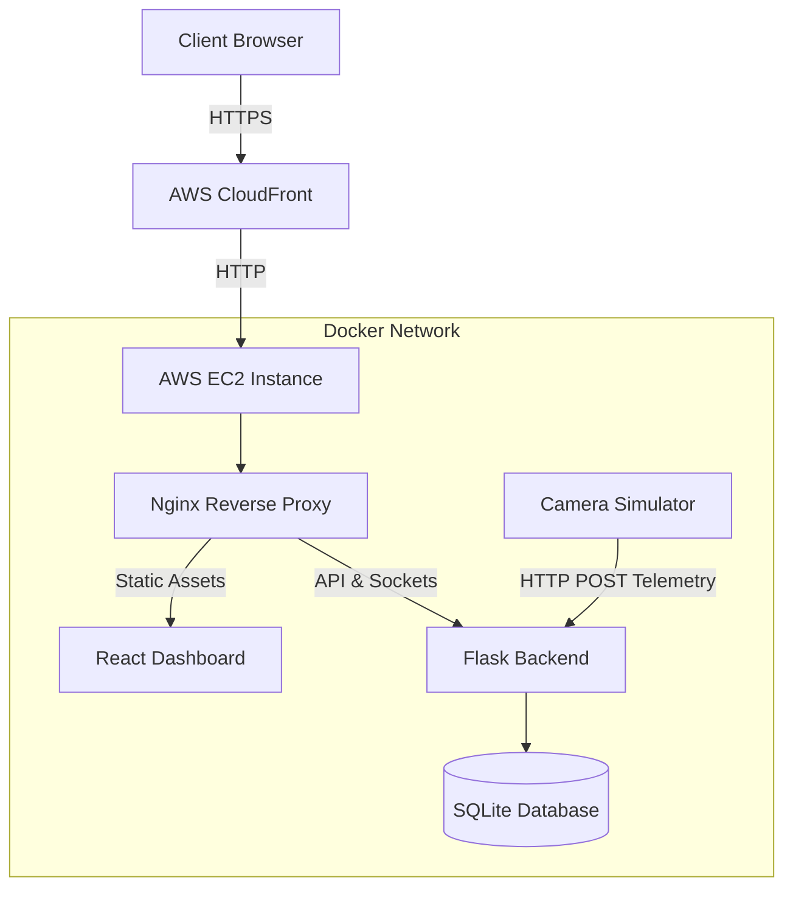

# 🎥 CamGuard — Multi-Camera Health Monitoring Platform

[](https://github.com/chudasamapujan/CamGuard/actions/workflows/ci.yml)
[](TEST_REPORT.md)
[](TEST_REPORT.md)

CamGuard is a real-time health monitoring and anomaly detection platform for security camera networks. In large-scale camera systems, cameras can fail silently due to network latency, high CPU load, storage exhaustion, or offline states, without triggering standard offline alerts immediately. CamGuard collects telemetry from cameras, analyzes their health status, and updates operator dashboards instantly. 

This project was built as a final-year engineering project to demonstrate a containerized, event-driven web application architecture.

---

## 🚀 Features

- **Real-Time Monitoring:** Live camera health telemetry processing and status evaluation.
- **Socket.IO Updates:** WebSockets push health updates and alerts to active client dashboards instantly.
- **React Dashboard:** A modular single-page React interface presenting health summaries, telemetry charts, and alert history.
- **Flask REST API:** Lightweight Python backend providing RESTful endpoints for camera configuration, history logs, and alerts.
- **Camera Simulator:** A multi-threaded simulation tool that acts as multiple IP cameras sending realistic metric updates.
- **Docker Compose:** Containerized microservices (frontend, backend, simulator) running in isolated local networks.
- **GitHub Actions CI:** Automated continuous integration pipelines running backend and frontend test suites on every code push.
- **Swagger API Documentation:** Built-in interactive API playground conforming to the OpenAPI 3.0 specification.
- **Automated Deployment Scripts:** Automated helper scripts to provision, deploy, and backup configurations on remote hosts.
- **API Security:** API key authorization rules securing configuration changes.
- **Rate Limiting:** Request limit controls built using Flask-Limiter to defend API routes.
- **AWS EC2 Deployment:** Targeted deployment support on cloud VMs running Linux (Ubuntu 22.04 LTS).
- **AWS CloudFront HTTPS Delivery:** SSL/TLS certificate delivery and fast static hosting via AWS CDN.

---

## 🏗️ Architecture

Below is the deployment and traffic flow of CamGuard:



---

## 📂 Folder Structure

```
camera-health-monitor/
├── .github/workflows/ci.yml   # GitHub Actions CI configuration
├── backend/                   # Python Flask API & WebSocket server
│   ├── routes/                # REST endpoints (alerts, settings, cameras, health)
│   ├── services/              # Business logic (evaluations, alerts, history)
│   ├── tests/                 # Pytest suite
│   ├── app.py                 # Application factory
│   └── models.py              # SQLAlchemy database models
├── dashboard/                 # React SPA frontend (Vite)
│   ├── src/components/        # Reusable dashboard components
│   ├── src/contexts/          # React contexts (Theme, WebSockets)
│   └── package.json           # Frontend package manifest
├── deployment/                # Automation bash scripts (setup, deploy, backup, update)
├── simulator/                 # Multi-threaded camera telemetry generator
├── docker-compose.yml         # Container orchestration manifest
├── nginx.conf                 # Reverse proxy, caching, and routing rules
└── TEST_REPORT.md             # Summary of backend and frontend test passes
```

---

## 🛠️ Technology Stack

| Category | Technology |
| :--- | :--- |
| **Frontend** | React, Vite, Socket.IO Client, Chart.js |
| **Backend** | Flask, SQLAlchemy, Flask-SocketIO, Gunicorn, Eventlet |
| **Database** | SQLite (default development), PostgreSQL Ready |
| **DevOps** | Docker, Docker Compose, Nginx, GitHub Actions |
| **Cloud** | AWS EC2, AWS CloudFront |
| **Security** | Flask-Limiter, API Key Authentication, HTTPS (CloudFront SSL/TLS) |

---

## ⚡ Quick Start

Set up and run the entire CamGuard system locally using Docker in under two minutes:

### 1. Clone & Configure
```bash
git clone https://github.com/chudasamapujan/CamGuard.git
cd CamGuard
cp .env.example .env
```

### 2. Launch Services
```bash
docker compose up --build -d
```

### 3. Verify Applications
Ensure the containers are up and running:
```bash
docker compose ps
```

Once running, access the local URLs:
- **Dashboard UI:** [http://localhost](http://localhost)
- **API Status:** [http://localhost/status](http://localhost/status)
- **API Swagger Docs:** [http://localhost/docs](http://localhost/docs)

---

## ⚙️ Configuration Guide

CamGuard can be configured either dynamically through the web interface or statically using environment variables.

### Dashboard Configuration

You can update system thresholds and telemetry settings on the fly from the **Settings** page in the dashboard UI:
- **Camera Count:** Adjust the number of simulated cameras in the fleet.
- **Reporting Interval:** Change how frequently cameras transmit telemetry data.
- **Fault Probability:** Set the likelihood of simulated camera faults.
- **CPU Threshold**, **Memory Threshold**, **Storage Threshold**, and **Latency Threshold:** Define the resource utilization boundaries for warning and critical states.
- **Offline Timeout:** Define the period after which a camera is marked offline if no heartbeats are received.

After clicking **Save Settings**:
1. The backend stores the new configuration in the database.
2. The camera simulator automatically synchronizes with the latest thresholds and interval values.
3. The dashboard UI immediately reflects the updated health status calculations.

### Environment Configuration

For application-level parameters, configure the `.env` file in the project root. Key variables include:
- `API_KEY`: The security token required to authorize settings updates.
- `DATABASE_URL`: The database connection string (defaults to a local SQLite database, supports PostgreSQL).
- `LOG_LEVEL`: Logging verbosity level (`DEBUG`, `INFO`, `WARNING`, or `ERROR`).
- `CAMERA_COUNT`: Default camera simulation count at container startup.
- `SIMULATOR_INTERVAL`: Default simulator tick rate in seconds.
- `VITE_API_URL` and `VITE_SOCKET_URL`: Client-side API and Socket endpoints pointing to the Nginx reverse proxy.

*Note: You must rebuild and restart the Docker containers (`docker compose up --build -d`) for any changes in the `.env` file to take effect.*

---

## ☁️ Deployment

CamGuard is configured to deploy to an **AWS EC2** instance running Ubuntu 22.04 LTS. The services run containerized via **Docker Compose**, with **Nginx** acting as a local reverse proxy inside the container network. To serve the application securely, **AWS CloudFront** is placed in front of the EC2 instance to deliver static assets and route API and WebSocket traffic over **HTTPS** using a valid SSL/TLS certificate managed by **AWS Certificate Manager (ACM)**.

To deploy:
1. **Provision EC2 & Security Groups:** Set up an EC2 instance. Allow inbound SSH (22) and HTTP (80) traffic.
2. **Setup VM Dependencies:** SSH into your instance, clone the repository, and run the configuration script:
   ```bash
   sudo bash deployment/setup.sh
   ```
3. **Run Deployment:** Start the containers and verify health:
   ```bash
   bash deployment/deploy.sh
   ```
4. **CloudFront Integration:** Configure an AWS CloudFront distribution to point to your EC2 host's HTTP endpoint. Use AWS Certificate Manager (ACM) to assign a valid SSL/TLS certificate for secure HTTPS access.

---

## 🧪 Testing

The repository uses automated test suites to maintain code quality:

- **Backend:** 22 Pytest unit and integration tests verifying API endpoints, rate limiting, and evaluation algorithms.
  ```bash
  pip install -r requirements-dev.txt
  pytest backend/tests -v
  ```
- **Frontend:** 25 Vitest tests mocking web socket state and UI components.
  ```bash
  cd dashboard
  npm install
  npm test -- --run
  ```

**Continuous Integration (CI):** GitHub Actions automatically runs both test suites on every git push to verify code stability.

---

## 🤖 AI Tools

AI tools (specifically ChatGPT, Claude, and Google Antigravity IDE) were used during this project to assist with:
- Learning new syntax, libraries, and configuration structures
- Debugging codebase errors and SQLite write locks
- Reviewing code formatting and quality
- Understanding deployment and network architectures
- Improving documentation clarity

Every major feature, configuration, and design decision was manually reviewed, verified, tested, and integrated into the project. The AI tools served as educational and debugging aids, and the final implementation represents my own understanding and engineering effort.

---

## ⚠️ Known Limitations

- **SQLite Development Datastore:** The local development environment uses SQLite, which is not designed for concurrent write scaling under heavy camera loads.
- **Single Backend Instance:** Without an external broker, Socket.IO runs on a single Gunicorn worker process to preserve socket states in memory.
- **Single Node Deployment:** AWS CloudFront currently routes to a single EC2 instance node, presenting a single point of failure.
- **Database & Scaling:** Swapping SQLite for PostgreSQL and introducing Redis is required to enable horizontal backend scaling.

---

## 🚀 Possible Future Enhancements

Although the current version meets the project requirements, there are several areas I would like to improve if I continue developing CamGuard:

- **Mobile Responsive Dashboard:** Optimize the dashboard layout for tablets and mobile devices to improve accessibility across different screen sizes.
- **User Authentication & Role-Based Access:** Add secure login with different permission levels for administrators and operators.
- **PostgreSQL Migration:** Replace SQLite with PostgreSQL for better scalability and concurrent database operations.
- **Redis Integration:** Use Redis as a Socket.IO message broker to support multiple backend instances.
- **Monitoring & Metrics:** Integrate Prometheus and Grafana for infrastructure and application monitoring.
- **Email & Notification System:** Send email notifications when cameras enter warning or critical states.
- **Advanced Camera Management:** Expand the previously developed camera management module with features such as camera registration, grouping, filtering, and configuration management if future project requirements need it.
- **Analytics Dashboard:** Add historical reports, trends, and health analytics for better operational insights.
